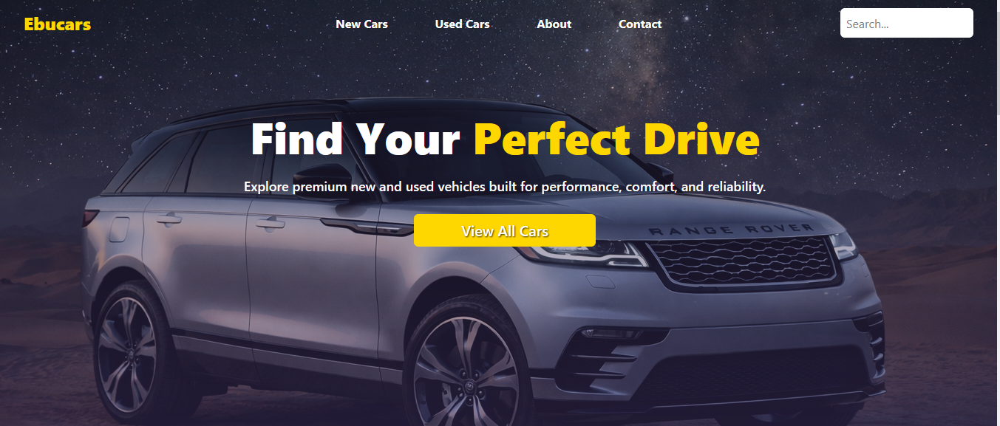

# 🚗 Ebucars — Modern Car Marketplace

Ebucars is a high-performance **React** automotive marketplace designed for browsing, filtering, and managing vehicle listings. It features a sleek, professional interface built with **Tailwind CSS** and a robust **Golang** backend to handle complex data operations and user management.

By integrating **Supabase** for real-time database needs and **Golang** for server-side logic, Ebucars provides a fast, secure, and scalable experience for both buyers and sellers.

🚘 Explore your dream car with a seamless, modern browsing experience.

---

## 🚀 Features

- 🏎️ **Vehicle Discovery**: Browse a wide range of cars with high-quality imagery and detailed specs.
- 🔍 **Advanced Filtering**: Search by make, model, price, and category to find exactly what you need.
- ⚡ **High-Performance Backend**: Powered by **Golang** for fast API responses and efficient data handling.
- 🛠️ **Dynamic Management**: Backend endpoints for listing updates and health monitoring.
- 📱 **Fully Responsive**: Optimized for desktop, tablet, and mobile using a mobile-first design approach.
- 🎨 **Modern UI**: Styled with **Tailwind CSS** for a clean, premium automotive aesthetic.
- ✨ **Rich Iconography**: Enhanced visual cues using **Font Awesome** and **React Icons**.

---

## 🛠️ Tech Stack

- **Frontend Framework:** React (Vite)
- **Styling:** Tailwind CSS
- **Backend:** Golang (API & Server Logic)
- **Database:** Supabase
- **Icons:** Font Awesome & React Icons
- **Routing:** React Router DOM
- **Deployment:** Netlify (Frontend) + Render (Backend)

---

## 📸 Screenshots

---

## 🌍 Live Demo

👉 [https://ebucars.netlify.app]

---

## 👤 Author

**Ebuka** — Full-stack Developer focused on creating interactive, data-driven applications with modern web technologies.
